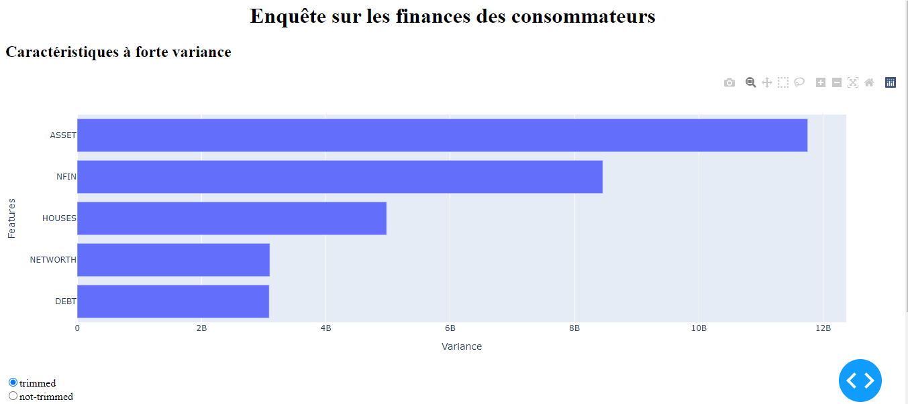

# U.S. consumer finances
In this project, we will be working with data from the US Survey of Consumer Finances. Our aim is to identify US households that have difficulty obtaining credit, and then segment these households into groups for targeted outreach.

The SCF survey is sponsored by the U.S. Federal Reserve. It collects financial, demographic and opinion information on families in the United States. The survey is conducted every three years, and we will be working on an extract of the 2019 results.
https://www.federalreserve.gov/econres/scfindex.htm

## 1.Exploring
Data import and EDA
## 2. Clustering
We'll examine all the features and select five to create clusters. After building our model and choosing an appropriate number of clusters, we'll learn how to visualize the multidimensional clusters in a 2D scatter plot using a method called Principal Component Analysis (PCA).

## 3.deployment
In the clustering file, we have built a model based on the highest variance features of our dataset and created several visualizations to communicate our results. In this file, we're going to combine all these elements into a dynamic web application that will allow users to choose their own features, build a model and evaluate its performance via a graphical user interface. In other words, you'll create a tool that lets anyone build a model without code.